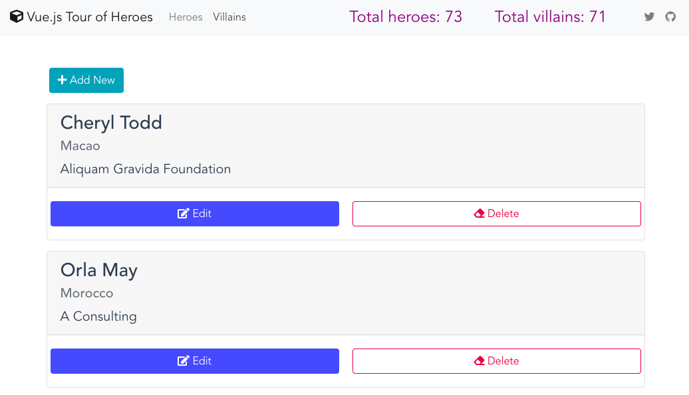

# My version of Tour of Heroes app using Vuejs with Vuex State Management.

### Features
HTTP request (using axios), navigation params, 2 different module structure (hereos and villains), computed values, optimistic ui update.

### To run the project after cloning

Create or go to your demo directory then run the following in the terminal or cmd.

```sh
$ git clone https://github.com/webmasterdevlin/heroes-vue.git
$ cd heroes-vue
$ npm install
$ npm run start
```

The React app and the fake web service will run concurrently.
Go to http://localhost:8080


